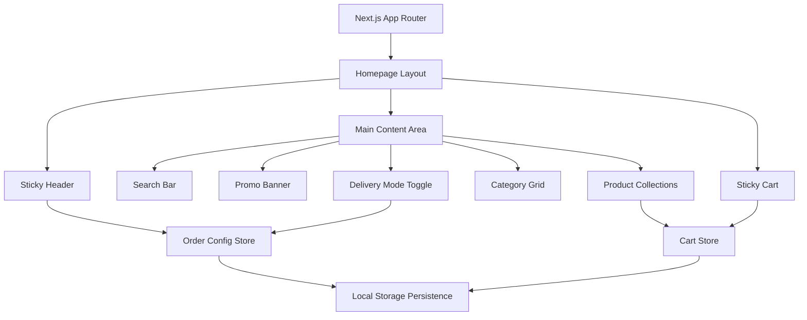

# Design Document: Bakery Homepage Mobile-First

## Overview

The Bakery Homepage is a mobile-first web application built with Next.js, React, TypeScript, and Tailwind CSS. It provides an intuitive, touch-optimized interface for browsing and ordering bakery products, inspired by successful F&B delivery platforms like GrabFood and ShopeeFood but customized for bakery-specific workflows.

### Core Design Principles

1. **Mobile-First Approach**: Optimize for 320-480px viewports as the primary target, then enhance for larger screens
2. **Touch-Optimized Interactions**: Minimum 48px touch targets, clear visual feedback, gesture-friendly scrolling
3. **Performance-Focused**: Lazy loading, image optimization, code splitting for sub-second initial load
4. **Type-Safe Architecture**: Strict TypeScript throughout with no `any` types in components
5. **Modular Feature Structure**: Domain-driven folder organization for maintainability

### Technology Stack

- **Framework**: Next.js 14+ (App Router)
- **UI Library**: React 18+
- **Language**: TypeScript (strict mode)
- **Styling**: Tailwind CSS 3+
- **State Management**: Zustand (lightweight, simple API ideal for this scope)
- **Image Optimization**: Next.js Image component
- **Testing**: Vitest, React Testing Library, Playwright

## Architecture

### High-Level Architecture



```

### Folder Structure

```

src/
├── app/
│ ├── page.tsx # Homepage root
│ ├── layout.tsx # Root layout with global providers
│ ├── search/
│ │ └── page.tsx # Search interface page
│ └── category/
│ └── [id]/
│ └── page.tsx # Category products page
├── components/
│ ├── common/
│ │ ├── Button/
│ │ │ ├── Button.tsx
│ │ │ └── index.ts
│ │ ├── Card/
│ │ ├── Modal/
│ │ └── Spinner/
│ └── layout/
│ ├── Header/
│ │ ├── Header.tsx
│ │ └── index.ts
│ ├── StickyCart/
│ └── BottomNavigation/
├── features/
│ └── home/
│ ├── components/
│ │ ├── SearchBar/
│ │ ├── PromoBanner/
│ │ ├── DeliveryModeToggle/
│ │ ├── CategoryGrid/
│ │ └── ProductCollection/
│ └── hooks/
│ └── useProductCollections.ts
├── store/
│ ├── cartStore.ts # Zustand cart state
│ └── orderConfigStore.ts # Zustand order configuration
├── types/
│ ├── product.ts
│ ├── category.ts
│ └── cart.ts
└── lib/
├── api.ts # API client utilities
└── utils.ts # Helper functions

```

```

### Component Architecture

#### Layout Layer

- **Header (Sticky)**: Fixed positioning, displays order timing and delivery address, triggers modals for configuration
- **StickyCart**: Fixed bottom positioning, displays cart summary, conditionally renders based on cart state
- **BottomNavigation**: Optional navigation bar for multi-page scenarios

#### Feature Layer (Home)

- **SearchBar**: Navigation trigger to search page
- **PromoBanner**: Promotional content display with touch interaction
- **DeliveryModeToggle**: Segmented control for delivery mode selection
- **CategoryGrid**: 4-column responsive grid of category cards
- **ProductCollection**: Horizontally scrollable product lists with lazy-loaded images

#### Common Layer

- **Button**: Reusable touch-optimized button with variants
- **Card**: Flexible card component for products and categories
- **Modal**: Bottom-sheet style modal for mobile interactions
- **Spinner**: Loading indicator

### State Management Strategy

**Zustand Store Pattern**: Lightweight state management with persistence middleware

1. **Cart Store**: Manages shopping cart items, quantities, totals
2. **Order Config Store**: Manages delivery mode, order timing, delivery address

Both stores will use Zustand's `persist` middleware to sync with localStorage for state persistence across page reloads.

## Components and Interfaces

### Core Components

#### 1. Header Component

**Purpose**: Sticky header displaying order configuration with modal triggers

**Props Interface**:

```typescript
interface HeaderProps {
  className?: string;
}
```

**Responsibilities**:

- Display current order timing and delivery address from OrderConfigStore
- Trigger OrderTimingModal on timing click
- Trigger AddressModal on address click
- Maintain fixed positioning during scroll
- Provide visual feedback on user interaction

**Key Behaviors**:

- Reads state reactively from `useOrderConfigStore()`
- Opens modal via local state management
- Mobile-optimized with 56px height
- Background with backdrop blur for visual hierarchy

---

#### 2. SearchBar Component

**Purpose**: Search input that navigates to search page on focus

**Props Interface**:

```typescript
interface SearchBarProps {
  placeholder?: string;
  className?: string;
}
```

**Responsibilities**:

- Display placeholder text "Bạn muốn tìm bánh gì hôm nay?"
- Navigate to `/search` page on tap/focus
- Meet 48px minimum touch target
- Provide visual search icon

**Key Behaviors**:

- Uses Next.js `useRouter()` for navigation
- Readonly input that acts as navigation trigger
- Touch-optimized sizing and spacing

---

#### 3. PromoBanner Component

**Purpose**: Display promotional content with navigation

**Props Interface**:

```typescript
interface PromoBannerProps {
  title: string;
  description: string;
  imageUrl: string;
  href: string;
  className?: string;
}
```

**Responsibilities**:

- Display promo image, title, and description
- Navigate to promotion details on tap
- Visually distinct styling (gradient, shadow)
- Responsive image loading

**Key Behaviors**:

- Uses Next.js Image component for optimization
- Wraps content in Next.js Link for navigation
- Touch-friendly with visual press feedback

---

#### 4. DeliveryModeToggle Component

**Purpose**: Segmented control for delivery mode selection

**Props Interface**:

```typescript
interface DeliveryModeToggleProps {
  className?: string;
}
```

**Responsibilities**:

- Display "Giao tận nơi" and "Đến cửa hàng lấy" options
- Highlight selected option visually
- Update OrderConfigStore on selection
- Meet 48px minimum touch target

**Key Behaviors**:

- Reads and updates `deliveryMode` from `useOrderConfigStore()`
- Segmented control design with sliding indicator
- Haptic feedback on selection (if available)

---

#### 5. CategoryGrid Component

**Purpose**: Display category navigation in 4-column grid

**Props Interface**:

```typescript
interface CategoryGridProps {
  categories: Category[];
  className?: string;
}
```

**Responsibilities**:

- Render categories in 4-column responsive grid
- Display category icon and label
- Navigate to category page on tap
- Optimize for mobile viewport

**Key Behaviors**:

- Uses CSS Grid with `grid-cols-4`
- Each category card is 48px+ touch target
- Uses Next.js Image for icon optimization
- Navigation via Next.js Link

---

#### 6. ProductCollection Component

**Purpose**: Horizontally scrollable list of products

**Props Interface**:

```typescript
interface ProductCollectionProps {
  title: string;
  products: Product[];
  onAddToCart: (product: Product) => void;
  className?: string;
}
```

**Responsibilities**:

- Display section title
- Render products in horizontal scroll container
- Show product card with image, name, price, add button
- Lazy load images on scroll
- Trigger cart addition

**Key Behaviors**:

- Horizontal overflow scroll with snap points
- Lazy image loading with Intersection Observer
- Calls `cartStore.addItem()` on add button click
- Smooth scrolling with momentum

---

#### 7. StickyCart Component

**Purpose**: Fixed bottom cart summary with navigation

**Props Interface**:

```typescript
interface StickyCartProps {
  className?: string;
}
```

**Responsibilities**:

- Display total quantity and price from CartStore
- Show "Xem giỏ hàng" button
- Conditionally render based on cart state
- Navigate to cart page on tap
- Fixed bottom positioning

**Key Behaviors**:

- Reads state from `useCartStore()`
- Renders only when `itemCount > 0`
- Fixed position with safe area insets
- Smooth slide-up animation on mount

---

#### 8. Modal Component (Common)

**Purpose**: Reusable bottom-sheet modal for mobile

**Props Interface**:

```typescript
interface ModalProps {
  isOpen: boolean;
  onClose: () => void;
  title: string;
  children: React.ReactNode;
  className?: string;
}
```

**Responsibilities**:

- Bottom-sheet style presentation
- Backdrop with tap-to-close
- Smooth slide animations
- Focus trap for accessibility
- Body scroll lock when open

**Key Behaviors**:

- Portal rendering for proper z-index
- Spring animation with Framer Motion
- Swipe-to-close gesture
- Escape key to close

## Data Models

### Product Type

```typescript
interface Product {
  id: string;
  name: string;
  price: number; // in VND
  imageUrl: string;
  categoryId: string;
  description?: string;
  availableForDelivery?: boolean;
  availableForPickup?: boolean;
}
```

**Validation Rules**:

- `id`: Non-empty string, unique identifier
- `name`: Non-empty string, 1-100 characters
- `price`: Positive number
- `imageUrl`: Valid URL string
- `categoryId`: Must reference existing category

---

### Category Type

```typescript
interface Category {
  id: string;
  name: string;
  iconUrl: string;
  displayOrder?: number;
}
```

**Validation Rules**:

- `id`: Non-empty string, unique identifier
- `name`: Non-empty string, 1-50 characters
- `iconUrl`: Valid URL string
- `displayOrder`: Optional positive integer for sorting

---

### CartItem Type

```typescript
interface CartItem {
  productId: string;
  quantity: number;
  price: number; // snapshot of price at time of addition
  product: Product; // denormalized for display
}
```

**Validation Rules**:

- `productId`: Must reference existing product
- `quantity`: Positive integer (min: 1)
- `price`: Positive number

---

### OrderConfig Type

```typescript
type DeliveryMode = "delivery" | "pickup";
type OrderTimingType = "now" | "scheduled";

interface OrderTiming {
  type: OrderTimingType;
  scheduledDate?: string; // ISO 8601 format
  scheduledTime?: string; // HH:mm format
}

interface OrderConfig {
  deliveryMode: DeliveryMode;
  orderTiming: OrderTiming;
  deliveryAddress?: {
    street: string;
    district: string;
    city: string;
  };
}
```

**Validation Rules**:

- `deliveryMode`: Must be 'delivery' or 'pickup'
- `orderTiming.type`: Must be 'now' or 'scheduled'
- When `type === 'scheduled'`, `scheduledDate` and `scheduledTime` are required
- `deliveryAddress` required when `deliveryMode === 'delivery'`

---

### Store State Types

#### CartStore State

```typescript
interface CartState {
  items: CartItem[];
  addItem: (product: Product) => void;
  removeItem: (productId: string) => void;
  updateQuantity: (productId: string, quantity: number) => void;
  clearCart: () => void;
  totalQuantity: number; // computed
  totalPrice: number; // computed
}
```

#### OrderConfigStore State

```typescript
interface OrderConfigState {
  config: OrderConfig;
  setDeliveryMode: (mode: DeliveryMode) => void;
  setOrderTiming: (timing: OrderTiming) => void;
  setDeliveryAddress: (address: OrderConfig["deliveryAddress"]) => void;
}
```

## Error Handling

### Error Boundaries

**Component-Level Error Boundaries**: Wrap each major feature section (CategoryGrid, ProductCollection) to prevent full-page crashes.

```typescript
// Example error boundary for ProductCollection
<ErrorBoundary fallback={<ProductCollectionError />}>
  <ProductCollection title="Gợi ý cho bạn" products={products} />
</ErrorBoundary>
```

**Global Error Boundary**: Root-level boundary in `layout.tsx` to catch unexpected errors.

---

### Network Error Handling

**Strategy**: Progressive enhancement with graceful degradation

1. **Initial Data Loading**:
   - Show skeleton loaders during fetch
   - Display retry button on failure
   - Cache successful responses in memory

2. **Cart Operations**:
   - Optimistic updates for immediate feedback
   - Rollback on failure with toast notification
   - Persist cart to localStorage as backup

3. **Image Loading**:
   - Placeholder images during load
   - Fallback to default image on 404
   - Retry mechanism with exponential backoff

---

### Validation Errors

**Client-Side Validation**: Immediate feedback for user input

1. **Order Timing Selection**:
   - Prevent past dates/times
   - Minimum 1-hour advance notice for scheduled orders
   - Display inline error messages

2. **Address Input**:
   - Required field validation
   - Format validation for Vietnamese addresses
   - Real-time validation feedback

---

### State Management Errors

**Store Error Handling**:

```typescript
// CartStore with error handling
addItem: (product: Product) => {
  try {
    set((state) => {
      const existingItem = state.items.find(
        (item) => item.productId === product.id,
      );
      if (existingItem) {
        return {
          items: state.items.map((item) =>
            item.productId === product.id
              ? { ...item, quantity: item.quantity + 1 }
              : item,
          ),
        };
      }
      return {
        items: [
          ...state.items,
          {
            productId: product.id,
            quantity: 1,
            price: product.price,
            product,
          },
        ],
      };
    });
  } catch (error) {
    console.error("Failed to add item to cart:", error);
    // Toast notification to user
  }
};
```

**LocalStorage Persistence Errors**: Graceful fallback if localStorage is unavailable (private browsing, quota exceeded).

## Testing Strategy

### Overview

Property-based testing is **not applicable** for this feature because it primarily involves UI rendering, component interactions, and visual state management. The testing strategy focuses on:

1. **Component Tests**: Unit tests for individual components using React Testing Library
2. **Integration Tests**: Tests for component interactions and state management
3. **End-to-End Tests**: Playwright tests for complete user journeys
4. **Visual Regression Tests**: Snapshot tests for visual consistency

---

### Component Testing

**Framework**: Vitest + React Testing Library

**Test Coverage Requirements**:

- All interactive components (buttons, toggles, cards)
- State updates and side effects
- Conditional rendering logic
- Accessibility attributes

**Example Test Cases**:

```typescript
// DeliveryModeToggle.test.tsx
describe('DeliveryModeToggle', () => {
  it('renders both delivery options', () => {
    render(<DeliveryModeToggle />);
    expect(screen.getByText('Giao tận nơi')).toBeInTheDocument();
    expect(screen.getByText('Đến cửa hàng lấy')).toBeInTheDocument();
  });

  it('updates store when option is selected', () => {
    render(<DeliveryModeToggle />);
    fireEvent.click(screen.getByText('Đến cửa hàng lấy'));
    expect(useOrderConfigStore.getState().config.deliveryMode).toBe('pickup');
  });

  it('highlights the selected option', () => {
    render(<DeliveryModeToggle />);
    const deliveryOption = screen.getByText('Giao tận nơi');
    expect(deliveryOption).toHaveClass('bg-primary'); // or appropriate selected class
  });
});
```

---

### Integration Testing

**Focus**: Component interactions, state synchronization, navigation flows

**Example Test Cases**:

```typescript
// CartFlow.integration.test.tsx
describe('Cart Flow Integration', () => {
  it('adds product to cart and updates sticky cart', () => {
    const { container } = render(<HomePage products={mockProducts} />);

    // Initially no sticky cart
    expect(screen.queryByText('Xem giỏ hàng')).not.toBeInTheDocument();

    // Add product
    const addButton = screen.getAllByText('Thêm')[0];
    fireEvent.click(addButton);

    // Sticky cart appears
    expect(screen.getByText('Xem giỏ hàng')).toBeInTheDocument();
    expect(screen.getByText('1 món')).toBeInTheDocument();
  });

  it('persists delivery mode selection across components', () => {
    render(<HomePage />);

    // Change delivery mode in toggle
    fireEvent.click(screen.getByText('Đến cửa hàng lấy'));

    // Verify header reflects the change (if applicable to design)
    // This tests state synchronization between components
  });
});
```

---

### End-to-End Testing

**Framework**: Playwright

**Test Scenarios**:

1. Complete order flow from homepage to cart
2. Search navigation and interaction
3. Category navigation
4. Modal interactions (order timing, address)
5. Responsive behavior across viewport sizes

**Example E2E Test**:

```typescript
// homepage.e2e.test.ts
test.describe("Homepage User Journey", () => {
  test("user can browse and add products to cart", async ({ page }) => {
    await page.goto("/");

    // Verify sticky header is visible
    await expect(page.locator("header")).toBeVisible();

    // Scroll to product collection
    await page
      .locator('[data-testid="product-collection"]')
      .first()
      .scrollIntoViewIfNeeded();

    // Add first product
    await page.locator('[data-testid="add-to-cart-btn"]').first().click();

    // Verify sticky cart appears
    await expect(page.locator('[data-testid="sticky-cart"]')).toBeVisible();
    await expect(page.locator('[data-testid="cart-quantity"]')).toHaveText("1");

    // Navigate to cart
    await page.locator("text=Xem giỏ hàng").click();
    await expect(page).toHaveURL("/cart");
  });

  test("user can change delivery mode", async ({ page }) => {
    await page.goto("/");

    // Change to pickup mode
    await page.locator("text=Đến cửa hàng lấy").click();

    // Verify visual feedback
    await expect(page.locator("text=Đến cửa hàng lấy")).toHaveClass(
      /selected|active/,
    );
  });

  test("search bar navigates to search page", async ({ page }) => {
    await page.goto("/");
    await page.locator('[data-testid="search-bar"]').click();
    await expect(page).toHaveURL("/search");
  });
});
```

---

### Visual Regression Testing

**Approach**: Snapshot tests for visual consistency

**Tools**:

- Jest/Vitest snapshots for component structure
- Playwright screenshots for visual appearance
- Percy or Chromatic for visual diff tracking (optional)

**Example Visual Tests**:

```typescript
// ProductCard.snapshot.test.tsx
describe('ProductCard Visual Snapshots', () => {
  it('matches snapshot for standard product', () => {
    const { container } = render(
      <ProductCard
        product={mockProduct}
        onAddToCart={jest.fn()}
      />
    );
    expect(container).toMatchSnapshot();
  });

  it('matches snapshot for out-of-stock product', () => {
    const { container } = render(
      <ProductCard
        product={{ ...mockProduct, availableForDelivery: false }}
        onAddToCart={jest.fn()}
      />
    );
    expect(container).toMatchSnapshot();
  });
});
```

---

### Accessibility Testing

**Requirements**:

- All interactive elements have proper ARIA labels
- Keyboard navigation works for all interactive elements
- Focus indicators are visible
- Color contrast meets WCAG AA standards
- Touch targets are minimum 48x48px

**Testing Tools**:

- `@axe-core/react` for automated accessibility audits
- Manual testing with screen readers (VoiceOver, NVDA)

**Example Accessibility Test**:

```typescript
// Accessibility.test.tsx
import { axe, toHaveNoViolations } from 'jest-axe';

expect.extend(toHaveNoViolations);

describe('Homepage Accessibility', () => {
  it('has no accessibility violations', async () => {
    const { container } = render(<HomePage />);
    const results = await axe(container);
    expect(results).toHaveNoViolations();
  });

  it('search bar is keyboard accessible', () => {
    render(<SearchBar />);
    const searchInput = screen.getByPlaceholderText('Bạn muốn tìm bánh gì hôm nay?');

    searchInput.focus();
    expect(searchInput).toHaveFocus();

    fireEvent.keyPress(searchInput, { key: 'Enter', code: 13 });
    // Verify navigation occurred
  });

  it('all buttons have accessible names', () => {
    render(<HomePage />);
    const buttons = screen.getAllByRole('button');

    buttons.forEach(button => {
      expect(button).toHaveAccessibleName();
    });
  });
});
```

---

### Performance Testing

**Metrics to Monitor**:

- Lighthouse Performance Score (target: ≥85 on mobile)
- First Contentful Paint (FCP): <1.8s
- Largest Contentful Paint (LCP): <2.5s
- Time to Interactive (TTI): <3.8s
- Cumulative Layout Shift (CLS): <0.1

**Testing Approach**:

- Automated Lighthouse CI in pull requests
- Real User Monitoring (RUM) in production
- Bundle size monitoring with webpack-bundle-analyzer

---

### Store Testing

**Zustand Store Tests**: Test state mutations and computed values

```typescript
// cartStore.test.ts
describe("CartStore", () => {
  beforeEach(() => {
    useCartStore.getState().clearCart();
  });

  it("adds item to empty cart", () => {
    const { addItem } = useCartStore.getState();
    addItem(mockProduct);

    const { items, totalQuantity, totalPrice } = useCartStore.getState();
    expect(items).toHaveLength(1);
    expect(totalQuantity).toBe(1);
    expect(totalPrice).toBe(mockProduct.price);
  });

  it("increments quantity for existing item", () => {
    const { addItem } = useCartStore.getState();
    addItem(mockProduct);
    addItem(mockProduct);

    const { items, totalQuantity } = useCartStore.getState();
    expect(items).toHaveLength(1);
    expect(items[0].quantity).toBe(2);
    expect(totalQuantity).toBe(2);
  });

  it("removes item from cart", () => {
    const { addItem, removeItem } = useCartStore.getState();
    addItem(mockProduct);
    removeItem(mockProduct.id);

    const { items, totalQuantity } = useCartStore.getState();
    expect(items).toHaveLength(0);
    expect(totalQuantity).toBe(0);
  });

  it("calculates total price correctly", () => {
    const { addItem } = useCartStore.getState();
    addItem({ ...mockProduct, price: 50000 });
    addItem({ ...mockProduct, id: "2", price: 30000 });

    const { totalPrice } = useCartStore.getState();
    expect(totalPrice).toBe(80000);
  });
});
```

---

### Test Coverage Goals

- **Unit Tests**: 80% code coverage minimum
- **Integration Tests**: All critical user flows covered
- **E2E Tests**: Happy path + 2-3 error scenarios per feature
- **Visual Regression**: All components with visual variants
- **Accessibility**: All interactive components tested with axe

## Implementation Notes

### Mobile-First Responsive Design

**Breakpoint Strategy**:

```typescript
// tailwind.config.js breakpoints
{
  sm: '480px',  // Large phones
  md: '768px',  // Tablets
  lg: '1024px', // Desktop
  xl: '1280px'  // Large desktop
}
```

**Implementation Approach**:

1. Design for 375px (iPhone 12/13/14 standard size) as baseline
2. Test at 320px (minimum) and 480px (maximum mobile)
3. Enhance layout for tablets (768px+) using Tailwind `md:` prefix
4. Add desktop optimizations for 1024px+ using `lg:` prefix

**Touch Target Guidelines**:

- Minimum 48x48px for all interactive elements
- Minimum 16px spacing between adjacent touch targets
- Visual feedback on touch (active states, ripple effects)

---

### Performance Optimization Checklist

1. **Image Optimization**:
   - Use Next.js Image component with `priority` for above-the-fold images
   - Implement lazy loading for product images in collections
   - Serve WebP format with JPEG fallback
   - Define explicit width/height to prevent layout shift

2. **Code Splitting**:
   - Dynamic import for Modal components (loaded on-demand)
   - Route-based code splitting via Next.js App Router
   - Lazy load non-critical features (search page, category pages)

3. **Bundle Size**:
   - Tree-shake unused Tailwind classes with PurgeCSS
   - Minimize external dependencies
   - Use Zustand instead of Redux for smaller bundle

4. **Caching Strategy**:
   - Static generation for homepage with ISR (revalidate every 60s)
   - Cache product data in memory with SWR or React Query
   - Service worker for offline support (optional Phase 2)

---

### TypeScript Configuration

**tsconfig.json** (strict mode):

```json
{
  "compilerOptions": {
    "strict": true,
    "noImplicitAny": true,
    "strictNullChecks": true,
    "strictFunctionTypes": true,
    "noUnusedLocals": true,
    "noUnusedParameters": true,
    "noFallthroughCasesInSwitch": true,
    "esModuleInterop": true,
    "skipLibCheck": true,
    "forceConsistentCasingInFileNames": true,
    "jsx": "preserve",
    "target": "ES2020",
    "lib": ["ES2020", "DOM", "DOM.Iterable"],
    "module": "ESNext",
    "moduleResolution": "bundler"
  }
}
```

**Type Safety Rules**:

- No `any` types in component props or state
- Use `unknown` for uncertain types, then type guard
- Define union types for string literals (e.g., DeliveryMode)
- Use branded types for IDs to prevent mixing product/category IDs

---

### State Persistence Strategy

**Zustand Persist Middleware**:

```typescript
import { persist } from "zustand/middleware";

export const useCartStore = create(
  persist<CartState>(
    (set, get) => ({
      items: [],
      addItem: (product) => {
        /* ... */
      },
      // ... other actions
    }),
    {
      name: "bakery-cart-storage",
      version: 1,
      migrate: (persistedState, version) => {
        // Handle version migrations
        return persistedState;
      },
    },
  ),
);
```

**Persistence Requirements**:

- Cart persists across page reloads
- Order config persists across sessions
- Clear cart on order completion
- Handle localStorage quota exceeded errors

---

### Styling Standards

**Tailwind CSS Conventions**:

- Use utility classes for layout and spacing
- Extract repeated patterns to custom components (not @apply)
- Define custom colors in tailwind.config.js for brand consistency
- Use Tailwind's built-in spacing scale (4px increments)

**Color Palette Example**:

```javascript
// tailwind.config.js
module.exports = {
  theme: {
    extend: {
      colors: {
        primary: {
          50: "#fef2f2",
          500: "#ef4444", // Main brand red
          600: "#dc2626",
          700: "#b91c1c",
        },
        accent: {
          500: "#f59e0b", // Orange for CTAs
        },
        neutral: {
          50: "#fafafa",
          100: "#f5f5f5",
          800: "#262626",
          900: "#171717",
        },
      },
    },
  },
};
```

**Component Styling Pattern**:

```typescript
// Use classnames/clsx for conditional classes
import clsx from 'clsx';

export const Button = ({ variant, children, className }: ButtonProps) => {
  return (
    <button
      className={clsx(
        'min-h-[48px] px-6 rounded-lg font-medium transition-colors',
        variant === 'primary' && 'bg-primary-500 text-white hover:bg-primary-600',
        variant === 'outline' && 'border-2 border-primary-500 text-primary-500',
        className
      )}
    >
      {children}
    </button>
  );
};
```

---

### API Integration Pattern

**Data Fetching Strategy**: Server Components + Client Components hybrid

```typescript
// app/page.tsx (Server Component)
async function HomePage() {
  // Fetch data server-side for initial load
  const [categories, featuredProducts] = await Promise.all([
    fetch('https://api.bakery.com/categories').then(r => r.json()),
    fetch('https://api.bakery.com/products/featured').then(r => r.json())
  ]);

  return (
    <>
      <Header />
      <SearchBar />
      <PromoBanner {...promoBannerData} />
      <DeliveryModeToggle /> {/* Client Component */}
      <CategoryGrid categories={categories} />
      <ProductCollections products={featuredProducts} />
      <StickyCart /> {/* Client Component */}
    </>
  );
}
```

**Client-Side Mutations**: Use Zustand actions for cart operations, no need for React Query mutations for simple local state.

---

### Accessibility Standards

**WCAG 2.1 Level AA Compliance**:

1. **Keyboard Navigation**:
   - All interactive elements accessible via Tab key
   - Modal focus trapping
   - Skip to main content link

2. **Screen Reader Support**:
   - Semantic HTML (header, nav, main, section)
   - ARIA labels for icon-only buttons
   - Live regions for cart updates

3. **Color Contrast**:
   - Text: minimum 4.5:1 ratio
   - Large text (18pt+): minimum 3:1 ratio
   - Interactive elements: clearly distinguishable

4. **Motion & Animation**:
   - Respect `prefers-reduced-motion` media query
   - Disable animations for users who prefer reduced motion

**Example Implementation**:

```css
@media (prefers-reduced-motion: reduce) {
  * {
    animation-duration: 0.01ms !important;
    transition-duration: 0.01ms !important;
  }
}
```

---

### Development Workflow

**Branch Strategy**:

- `main`: Production-ready code
- `develop`: Integration branch for features
- `feature/*`: Individual feature branches

**Code Review Checklist**:

- [ ] TypeScript strict mode passes with no errors
- [ ] All components have unit tests
- [ ] Accessibility audit passes (axe)
- [ ] Mobile responsive at 320px, 375px, 480px
- [ ] Touch targets meet 48px minimum
- [ ] Performance budget met (Lighthouse ≥85)
- [ ] No console errors or warnings
- [ ] Visual regression tests pass

**Pre-commit Hooks** (using Husky):

- ESLint auto-fix
- Prettier formatting
- TypeScript type checking
- Unit tests run

---

### Future Enhancements (Phase 2)

1. **Progressive Web App**:
   - Service worker for offline support
   - Install prompt for home screen
   - Push notifications for order updates

2. **Advanced Search**:
   - Autocomplete suggestions
   - Search history
   - Filters (price range, category, dietary restrictions)

3. **Personalization**:
   - Recent orders quick reorder
   - Favorite products
   - Personalized recommendations based on order history

4. **Animations**:
   - Page transitions with Framer Motion
   - Micro-interactions (like animations, haptic feedback)
   - Skeleton loaders for better perceived performance

5. **Internationalization**:
   - Multi-language support (Vietnamese, English)
   - Currency formatting
   - Date/time localization

---

## Design Decisions and Rationale

### Why Zustand Over Redux Toolkit?

**Decision**: Use Zustand for state management

**Rationale**:

- Smaller bundle size (~1KB vs ~10KB for RTK)
- Simpler API with less boilerplate
- Built-in persistence middleware
- Sufficient for this application's state complexity
- Better TypeScript inference out of the box

**Trade-off**: Less ecosystem tooling (no Redux DevTools time-travel), but Zustand DevTools exist as an alternative.

---

### Why Bottom Sheet Modals Over Full-Page Modals?

**Decision**: Use bottom-sheet style modals for mobile

**Rationale**:

- Native mobile app pattern (iOS/Android)
- Better thumb reachability on large phones
- Smooth gesture-based interactions (swipe to close)
- Less jarring than center modals on small screens
- Follows GrabFood/ShopeeFood UX patterns

**Trade-off**: More complex animation implementation, but better UX justifies the effort.

---

### Why Horizontal Scroll Over Grid for Product Collections?

**Decision**: Use horizontally scrollable lists for product collections

**Rationale**:

- Preserves vertical scroll momentum
- Indicates more content available (partial card visible)
- Better performance (lazy load off-screen items)
- Matches user mental model from similar apps
- Reduces decision paralysis (fewer items visible at once)

**Trade-off**: Discoverability slightly reduced, but mitigated by partial card peek.

---

### Why Next.js App Router Over Pages Router?

**Decision**: Use Next.js 14 App Router

**Rationale**:

- Server Components by default (better performance)
- Built-in loading and error states
- Nested layouts and templates
- Streaming SSR support
- Future-proof architecture (Pages Router in maintenance mode)

**Trade-off**: Steeper learning curve, but long-term benefits outweigh initial complexity.

---

### Why 4-Column Category Grid?

**Decision**: Display categories in 4-column grid on mobile

**Rationale**:

- Optimal information density for 375px viewport
- Each cell is ~94px wide (enough for icon + label)
- Matches user expectations from similar apps
- Reduces vertical scroll required to see categories
- Maintains 48px+ touch targets with spacing

**Trade-off**: Icons/text must be small but still legible (tested at 320px).

---

## Glossary Updates

- **Bottom Sheet Modal**: Modal that slides up from the bottom of the screen, common in mobile apps
- **Lazy Loading**: Technique to defer loading of non-critical resources until needed
- **Touch Target**: The interactive area of an element that responds to touch input
- **Zustand**: Lightweight state management library for React
- **ISR (Incremental Static Regeneration)**: Next.js feature to update static content without full rebuild

---

## Appendix: Key Dependencies

```json
{
  "dependencies": {
    "next": "^14.0.0",
    "react": "^18.2.0",
    "react-dom": "^18.2.0",
    "zustand": "^4.4.0",
    "clsx": "^2.0.0",
    "framer-motion": "^10.16.0"
  },
  "devDependencies": {
    "@types/react": "^18.2.0",
    "@types/node": "^20.0.0",
    "typescript": "^5.2.0",
    "tailwindcss": "^3.3.0",
    "vitest": "^1.0.0",
    "@testing-library/react": "^14.0.0",
    "@playwright/test": "^1.40.0",
    "eslint": "^8.50.0",
    "prettier": "^3.0.0"
  }
}
```
